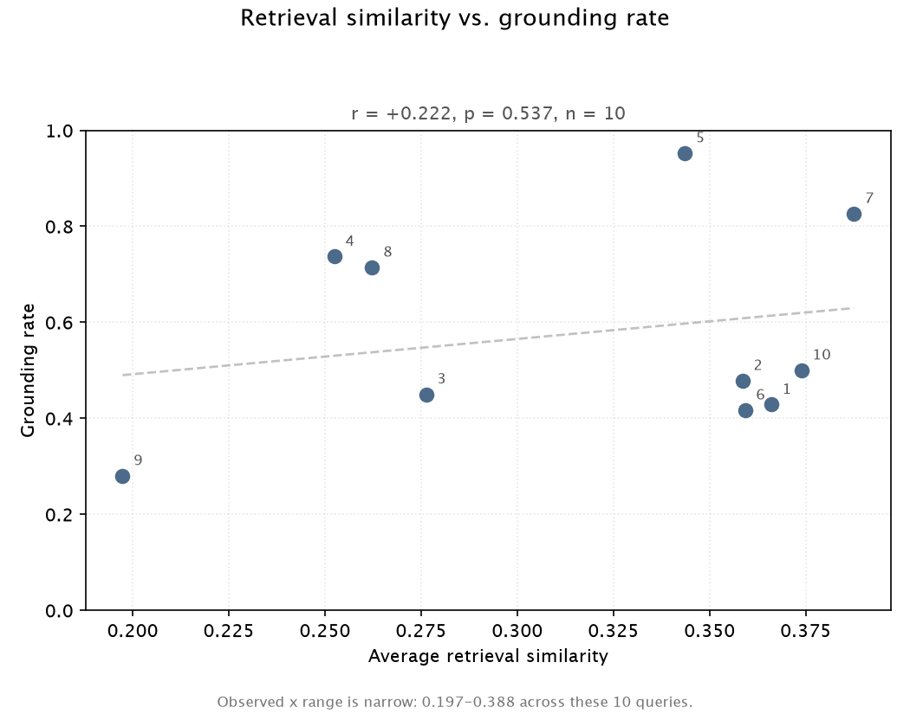

# hci-rag-eval

**Does better retrieval produce better-grounded generation? In this setup, the answer is: not measurably.**

A small retrieval-augmented generation (RAG) pipeline over HCI paper abstracts, built to quantify the **validity**, **reliability**, and **actionability** of LLM-generated research insights — and to test whether retrieval quality predicts generation quality.

The retrieval layer is deliberately simple (sentence embeddings + cosine similarity). The evaluation layer is where the work is.

---

## Main result

Across 10 queries × 5 reruns (50 generation attempts, 49 usable after one parse failure; 706 API calls), retrieval similarity showed **no reliable relationship** with any generation-quality metric:

| Metric | Pearson r | p | n |
|---|---|---|---|
| grounding rate | +0.222 | 0.537 | 10 |
| semantic consistency | +0.410 | 0.240 | 10 |
| claim overlap (Jaccard) | +0.239 | 0.506 | 10 |
| actionability | +0.128 | 0.724 | 10 |



The direction was **not stable across sample sizes**: an earlier 5-query run gave r = −0.147, and a 3-query pilot pointed negative as well (both from development notes, [NOTES.md](NOTES.md) §13 — not archived experiment runs). Three runs, three inconsistent directions, none significant.

**This is reported as a negative result, not a trend.** A likely design limitation: the observed range of retrieval similarity was narrow (0.197–0.388, sd = 0.065). Testing this hypothesis properly would require deliberately constructing query sets with a wider spread in retrieval quality.

---

## Secondary finding: citation hallucinations are near-miss ID confusions

Three of the ten queries produced at least one citation to a paper ID that was **not** in the retrieved context. All three were single-character confusions with a real neighbouring ID — **none were fabricated from nothing**:

| Type | Model output | Actual ID in context |
|---|---|---|
| Digit swap | 2008.**035**82v1 | 2008.**025**82v1 |
| Version suffix | 2006.00372**v1** | 2006.00372**v2** |
| Year prefix | **2005**.02582v1 | **2008**.02582v1 |

The structure of arXiv IDs (`YYMM.NNNNNvV`) makes single-position errors easy to produce and hard to spot: the output is **syntactically valid**, so an LLM judge reading it in prose has no obvious signal that anything is wrong.

These were caught by `citation_validity_rate` — a deterministic set-membership check that requires **no API calls at all**. This validates the two-layer validity design: the cheapest layer catches the most easily-missed error class, and the expensive LLM-judge layer is reserved for semantic entailment.

---

## Evaluation design

Three dimensions, each with its own measurement strategy:

**Validity** — two layers.
1. `citation_validity_rate`: deterministic check that every cited paper ID appears in that run's top-k context. No API cost.
2. `grounding_rate`: an independent LLM judge decides whether each claim is entailed by the abstracts it cites. Three votes per claim at temperature 0; all votes retained so judge self-consistency can itself be measured.

**Reliability** — same prompt, five reruns, three levels of agreement.
- Semantic: mean pairwise cosine similarity across runs
- Content: Jaccard overlap of claims after greedy threshold matching
- Numeric: Krippendorff's α on citation choices; ICC(2,1) on confidence scores at the **experiment level** (rows = queries, columns = reruns)

**Actionability** — 1–5 rubric, LLM judge, three votes, median. Raw votes retained.

---

## Statistical implementation is verified, not assumed

`src/stats.py` implements ICC(2,1), Krippendorff's α, Cohen's κ, and Jaccard similarity from the formulas rather than calling a black box. Every expected value in the test suite traces to a source outside this project:

| Test | Expected value from |
|---|---|
| ICC(2,1) = 0.290 | Shrout & Fleiss (1979), Table 1 |
| ICC(2,1) cross-check | `pingouin.intraclass_corr` (ICC(A,1)) |
| Cohen's κ = 0.40 | Documented hand calculation in the test |
| Jaccard = 0.5 | Documented hand calculation in the test |
| Boundary cases | Formula convergence properties |

This mattered. An early version of `icc_2_1` had an axis inconsistency that produced **0.161** and **0.743** on the benchmark matrix depending on input orientation — both plausible-looking numbers that happen to correspond to *different ICC variants* (ICC(1,1) and ICC(C,1)). It did not raise; it silently answered a different statistical question.

**[`NOTES.md`](NOTES.md) documents this and sixteen other findings** from building the pipeline — the bugs, how each was caught, and what they imply about trusting fluent-looking output. It is the most substantive part of this repository.

---

## Running it

```bash
python3.12 -m venv .venv && . .venv/bin/activate
pip install -r requirements.txt
echo "ANTHROPIC_API_KEY=sk-ant-..." > .env

python main.py --queries 10 --reruns 5
```

Tests (must use the venv interpreter — a system `pytest` will silently use the wrong environment):

```bash
.venv/bin/python -m pytest tests/ -v    # 39 tests
```

Reuse existing generations to re-run only the evaluation stages:

```bash
python main.py --reuse-generations
```

**Cost and time.** The full 10×5 run made 706 API calls for **$1.22**. Wall-clock time was ~6.5 hours because the machine slept mid-run; active compute time was 44.8 minutes. Use `caffeinate -i` for unattended runs — the pipeline now reports both figures and warns when they diverge.

All parameters live in `config.yaml`. `budget.max_api_calls` is a hard ceiling that aborts the run rather than a soft warning.

---

## Limitations

- **n = 10 queries.** No correlation could reach significance at this sample size regardless of effect.
- **Narrow retrieval-quality range.** Similarity spanned 0.197–0.388; this may be too little variation to detect an effect even if one exists.
- **Single model, single domain.** All generation and judging used one model on `cs.HC` abstracts.
- **LLM-as-judge is unvalidated against humans.** The pipeline exports `validity_for_human_review.csv` for manual annotation, and Cohen's κ against those labels is implemented and tested — but the human annotation has not been done. Grounding rates should be read as *this judge's* assessment, not ground truth.
- **Confidence scores show little spread.** Per-query standard deviations of the model's self-reported confidence were small (mean sd across queries well under 0.05), limiting what ICC on that field can detect.

---

## Layout

```
src/stats.py                 ICC, Krippendorff's α, Cohen's κ, Jaccard
src/retrieve.py              Embedding retrieval + quality metrics
src/generate.py              Structured generation with rerun support
src/evaluate_validity.py     Citation check + LLM-judge grounding
src/evaluate_reliability.py  Three-level agreement measurement
src/evaluate_actionability.py  Rubric scoring
src/llm_client.py            Call counter, budget ceiling, cache
tests/                       39 tests
NOTES.md                     Methodological record
```

---

## Useful extensions

- Replace the default `all-MiniLM-L6-v2` embedding model with another sentence-transformer model.
- Compare LLM-as-judge vs. a lightweight NLI model for grounding.
- Add more queries and measure how retrieval quality correlates with output validity, with a query set deliberately constructed for wider retrieval-similarity spread.
